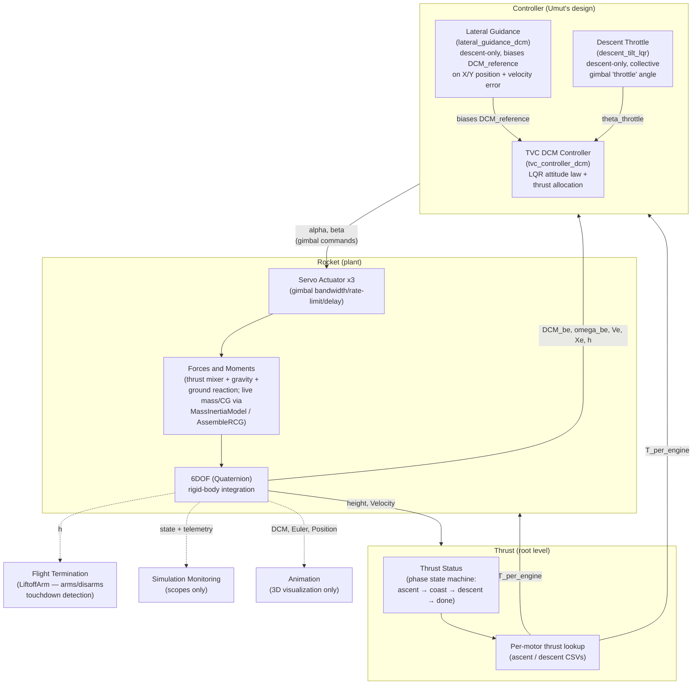

# TVC Rocket 6DOF Model — Walkthrough

This is a guided tour of `rocket_upwork.slx`, written for someone
learning the model from scratch, in **physical/logical flow order**, not
implementation chronology. It is meant to be readable on its own, without
opening Simulink, as a first pass.

This is **not** a replacement for `DEVELOPMENT_NOTES.md`, which covers
design decisions and known limitations in more depth. This document
explains *what the model does and why*, in one linear read; where
something is a placeholder or simplification, it's called out inline.

## 1. High-level signal flow



Thrust generation (`Thrust`, section 3) lives at root level, alongside
`Rocket`, not inside it — it reads `height`/`Velocity` off the same root
Goto/From bus every other subsystem reads, and writes its per-motor
`T_per_engine` output onto the root bus, which both `Controller` (for
thrust allocation) and `Rocket` (straight into the plant's force/moment
mixer) take in as an inport.

One paragraph per stage:

- **Thrust:** a flight-phase state machine (`Thrust Status`: ascent →
  coast → descent → done) drives which per-motor thrust curve (ascent or
  descent CSV) is active each timestep; output is `T_per_engine`, read by
  both `Controller` and `Rocket`.
- **Controller:** reads the vehicle's current attitude (`DCM_be`) and
  angular rate (`omega_be`), compares against a reference attitude, and
  computes corrective per-motor gimbal angle commands (`alpha`, `beta`) via
  an LQR law and thrust allocation (`TVC DCM Controller`). During descent
  only, two feedforward terms are added on top: a collective "throttle"
  tilt from `Descent Throttle` (net vertical thrust control, since the
  solid motors can't be throttled directly) and a small off-vertical bias
  from `Lateral Guidance` (closes the horizontal position/velocity loop
  that nothing else in this architecture handles).
- **Rocket (plant):** the controller's *commanded* `alpha`/`beta` first
  pass through `Servo Actuator` (models the physical gimbal servo's
  bandwidth, rate limit, and delay) to get the *physically realized*
  angles; `Forces and Moments` combines per-motor thrust (gimbal-rotated),
  aerodynamic force/moment (currently disabled), gravity, and a launch-pad
  ground-reaction force into one net body-frame force `F_total` and moment
  `M_total` each timestep, using the vehicle's live time-varying mass and
  inertia as propellant burns; `6DOF (Quaternion)` integrates the rigid-body
  equations of motion and outputs position, velocity, attitude, and
  angular rate, which close the loop back into `Controller` and `Thrust`.
- **Flight Termination / Simulation Monitoring / Animation:** read-only
  consumers of the plant's state (touchdown-detection arming, review
  scopes, 3D viewer respectively) — none of them feed anything back into
  the control loop.

## 2. Mass & inertia (`MassInertiaModel`)

Path: `Forces and Moments/Forces and Moments/MassInertiaModel`

As the 3 KNSB motors burn propellant, the vehicle gets lighter, its inertia
drops, and its CG shifts toward the nose. All four quantities are derived
from **one** linear depletion fraction, `frac_burned`, so they stay
physically consistent with each other:

```
frac_burned(t) = t / t_burn          (0 at ignition, 1 at burnout, then holds at 1)

m(t)     = m_dry + m_prop * (1 - frac_burned)
m_dot(t) = -m_prop / t_burn            while burning, else 0

Ixx(t) = Ixx_dry + Ixx_prop * (1 - frac_burned)   (same form for Iyy, Izz)
dIxx/dt(t) = -Ixx_prop / t_burn        while burning, else 0   (analytic derivative)

x_cg(t) = x_cg_initial + (x_cg_burnout - x_cg_initial) * frac_burned
```

`m_dry = 1.310 kg`, `m_prop = 0.690 kg` (client-measured, all fed in from
`matl.m`). `x_cg_initial = 1.090 m`, `x_cg_burnout = 1.0373 m` from nose
tip (derived assuming propellant burns from the motor pivot, not the true
propellant centroid - a simplifying assumption, not a measurement).
`mass_burn_duration = 20 s` is a single continuous ramp covering ascent +
descent together - this chart intentionally does not know about the
separate ascent/descent phase split that `Thrust Status` tracks (one
continuous depletion model, not a bug).

`I(t)` is diagonal only, with **no parallel-axis correction** for the CG
shift `x_cg(t)` - a deliberate M1 simplification (`Iyy`/`Izz` measured via
bifilar pendulum, `Ixx` still an unmeasured placeholder). `dI/dt` is
required as an independent input alongside `I` (not derived internally by
the 6DOF block) because the full variable-inertia Euler equation needs the
`I_dot*omega` "phantom torque" term explicitly:

```
M = I*omega_dot + I_dot*omega + omega x (I*omega)
```

`x_cg(t)` feeds `AssembleRCG`, which turns it into the axial component of
the per-motor moment arm:

```
r_cg(1,i) = x_cg(t) - engine_pivot_from_nose      (same for all 3 motors)
r_cg(2,i) = r_arm * cos(azimuth_deg(i))            (static, doesn't change with burn)
r_cg(3,i) = r_arm * sin(azimuth_deg(i))
```

## 3. Thrust generation (`Thrust`, root level)

`Thrust` is a root-level subsystem (not inside `Rocket`), taking
`height`/`Velocity` off the root Goto/From bus and outputting the per-motor
`T_per_engine` 3-vector and `phase` onto that same bus. Both ascent and
descent now read directly off their CSVs (`thrust_data_ascent_clean.csv`,
`thrust_data_descent_clean.csv`) - there is no MATLAB-side `interp1` and no
artificial/test-thrust Manual Switch layer any more; each CSV has 4
columns (`time_seconds, thrust_m1_N, thrust_m2_N, thrust_m3_N`) loaded by
`matl.m` into a `3xN` array per phase (`rocket.ascent_thrust_curve_N`,
`rocket.descent_thrust_curve_N`). Per-motor columns are currently identical
(duplicated from the old single-sensor static-test data) until real
per-motor test data exists - see "Descent is a placeholder" in
`DEVELOPMENT_NOTES.md`, still true for descent's *data*, even though the
wiring mechanism is now identical to ascent's.

### Thrust Status

A vehicle-level flight-phase state machine (one CG trajectory, one phase -
not per-motor):

```
phase 1 (ASCENT)  -- t < t_burn_ascent --> phase 2 (COAST)
phase 2 (COAST)    -- descending & h<=ignition_altitude --> phase 3 (DESCENT BURN)
phase 3 (DESCENT)  -- propellant exhausted (t_burn_descent after ignition) --> phase 4 (DONE)
```

Phase 1→2 is **time-triggered**, but `t_burn_ascent` is not a fixed number -
it's derived from the real ascent thrust curve's own last timestamp
(currently ~21.5s). Phase 2→3 is **altitude/velocity-triggered**,
against a parameterized `ignition_altitude` (15m), not
time-triggered - this matters because `remaining_fuel_time_s` (this chart's
second output) only counts down meaningfully during phase 3; during phase 1
it's a constant, not usable for ascent timing. It's a MATLAB Function block
with `persistent` state, which requires an explicit discrete
`SystemSampleTime` (`0.001`, matching the fixed-step solver) rather than
`-1` (inherited/continuous).

### Per-motor thrust lookup (`AscentLUT_M1..3`, `DescentLUT_M1..3`)

Interpolation itself happens in six native `1-D Lookup Table` blocks (3
motors x 2 phases, `ExtrapMethod=Clip` to replicate the old hold-last-value
behavior at the ends of each curve), not in a MATLAB Function:

```
AscentLUT_Mi(t)   = interp1(ascent_thrust_curve_t,  ascent_thrust_curve_N(i,:),  t)
DescentLUT_Mi(t') = interp1(descent_thrust_curve_t, descent_thrust_curve_N(i,:), t')
    where t' = t_burn_descent - remaining_fuel_time_s   (elapsed time since descent ignition)
```

The ascent lookups run directly off the free-running `Clock` (raw
simulation time, since ascent starts at `t=0`); the descent lookups run off
`t'`, reconstructed from `Thrust Status`'s `remaining_fuel_time_s` output
the same way the old `PerMotorThrust` MATLAB Function used to. `ThrustSelect`
(a `MultiPortSwitch`) then picks the active phase's 3-vector using `phase`
from `Thrust Status` as the control input: `AscentVec` (phase 1),
`ZeroVec` (phase 2, coast), `DescentVec` (phase 3), `ZeroVec` (phase 4,
done).

Output is `T_per_engine`, a `[3x1]` **column** vector, not a row (a row
vector causes a port-dimension-mismatch compile error against downstream
consumers).

## 4. Force/moment mixing (`rocket_forces_moments`)

Path: `Forces and Moments/Forces and Moments/MATLAB Function`

The body-frame force/moment mixer, combining all 3 motors' thrust with aero
and gravity:

```
F_i = T(i) * [cos(alpha(i))*cos(beta(i)); sin(alpha(i))*cos(beta(i)); sin(beta(i))]
M_i = cross(r_cg(:,i), F_i)

F_total = sum(F_i) + F_aero + F_grav
M_total = sum(M_i) + M_aero
```

`alpha`/`beta` are the per-motor pitch/yaw gimbal deflections from the
controller (section 7). At zero deflection, `F_i` reduces to `[T(i);0;0]` -
thrust purely along **+x_b**, confirmed to be the vehicle's vertical/thrust
axis (see section 5 for why this matters, and `DEVELOPMENT_NOTES.md`'s
Physics/math conventions for the numerical verification).

`r_cg` comes from `AssembleRCG` (section 2) - the moment arm here **does**
track the burning CG. Note (audit finding, `matl.m` comments on
`rocket.r_cg`): the TVC controller's own thrust-allocation matrix uses a
**different, static** `r_cg` (frozen at t=0), not this dynamic one - a real
asymmetry, not fixed in this pass.

## 5. Ground/launch-pad physics

### GroundReaction (`Forces and Moments/GroundReaction`)

Solves a real physics gap the switch to real thrust data exposed: the
measured thrust curve takes ~1-1.5s to exceed the vehicle's weight after
ignition. Without this block, the vehicle free-falls through the ground
during that window before the touchdown detector falsely fires.

```
if h <= 0.001:
    F_reaction(x_b) = -min(F_total_pre(x_b), 0)   # cancel net-downward x_b force exactly
    F_reaction(y_b, z_b) = 0                       # lateral force untouched
else:
    F_reaction = [0;0;0]                            # fully airborne, no effect
```

Only the vertical (`x_b`) axis is held - moments and lateral force pass
through untouched, so attitude correction still works normally while
grounded. This models a launch rail: it can only push up along the rail
axis, not sideways or rotationally.

### LiftoffArm (root level)

A separate concern from `GroundReaction` above: the model's touchdown
detector (`Hit Crossing`/`Stop Simulation`) has **zero tolerance**, so even
`GroundReaction`'s small residual pad-phase dip (~-0.043m, from the small
uncancelled lateral gravity component at the ~85° launch attitude) would
falsely trigger it. `LiftoffArm` is a one-way latch: touchdown detection
stays disabled until `h` first exceeds 1.0m, then stays permanently enabled
for the rest of the flight (including a later hover/landing approach).
Deliberately not a fixed tolerance on `Hit Crossing` itself, since the
ground-phase dip depth is sensitive to attitude/thrust-curve details and
isn't a fixed number worth hardcoding a tolerance around.

## 6. 6DOF integration

Block: `6DOF (Quaternion)` (root level), `aerolib6dof2/Custom Variable Mass
6DOF (Quaternion)`.

**Inputs:** `F_xyz` (=`F_total`, N), `M_xyz` (=`M_total`, N-m), `m` (kg),
`dI/dt` (kg·m²/s), `I` (kg·m²) - all body-frame, all from sections 2 and 4
above.

**Outputs:** `Ve` (Earth-frame velocity, m/s), `Xe` (Earth-frame position,
m), Euler angles `[phi,theta,psi]` (rad), `q` (quaternion, currently
unconnected/unused), `DCMbe` (body-from-Earth rotation matrix), `Vb`
(body-frame velocity, unused downstream), `omega_be` (body angular rate,
rad/s).

**Why quaternion, not Euler angles:** the vehicle's nominal flight condition
is near-vertical (~90° pitch). An Euler-angle representation has a
mathematical singularity (gimbal lock) exactly at 90° pitch; a quaternion
representation has no such singularity anywhere. The controller (section 7)
also computes its attitude error via DCM, not Euler subtraction, for the
same reason.

`mtype=Custom Variable Mass`: the block does **not** compute mass/inertia
internally - it trusts `m`, `dI/dt`, `I` fed in externally each step (from
`MassInertiaModel`), and requires them to be consistent with each other
(the `I_dot*omega` term in the Euler equation only cancels correctly if they
are). This block was migrated from a legacy masked block
(`aerolibobsolete/6DOF (Euler Angles)`) to this clean, current-Aerospace-
Blockset block, verified equivalent before the switch.

## 7. Controller / actuator (Umut's contribution)

High-level only - this is Umut's design; the goal here is to understand the
*interface*, not audit code someone else is responsible for.

**Attitude controller** (`TVC DCM Controller/MATLAB Function1`,
`tvc_controller_dcm`): reads the vehicle's current attitude (`DCMbe`) and
rate (`omega_be`), computes a DCM-based attitude error (a "vee-map" of the
skew-symmetric part of `DCM_be * DCM_reference'`, valid for small errors),
feeds `[attitude_error; rate]` into an LQR feedback law
(`M_cmd = -K * state_error`, `K` designed offline by `lqr_gain_design.m`),
then allocates that commanded moment across the 3 motors' gimbal axes via a
pseudo-inverse allocation matrix, clamped to gimbal limits. The allocation
matrix is linearized around each motor's current nominal (throttle-only)
direction, not around zero — needed because collective tilt during descent
reaches up to 60°, where a zero-point linearization would misallocate
thrust between the axial and lateral components (see
`DEVELOPMENT_NOTES.md`'s TVC mixer fix). During descent, a separate
collective "throttle angle" (below) is added on top as a feedforward term.

**Descent hover throttle** (`Descent Throttle/MATLAB Function2`,
`descent_tilt_lqr`): since the solid motors can't be throttled by reducing
chemical output, this function throttles *net vertical thrust* a different
way - commanding all 3 motors to cant outward together by a collective angle
`theta_throttle`, so vertical thrust becomes `T_total*cos(theta)` while each
motor still burns at full thrust. A simple altitude/velocity feedback law
adjusts this angle around a computed hover-equilibrium value. Only active
during phase 3 (descent burn). Its equilibrium calc used to read the flat
`rocket.T_nominal` scaled by `n_engines`; it now takes the live
`T_per_engine` vector (available at `Controller`'s boundary since `Thrust`
moved to root level) and uses `sum(T_per_engine)` instead - equivalent when
the vector is flat, but it now legitimately varies over the descent burn
rather than being a constant assumption.

**Servo actuator dynamics** (`Servo Actuator`, `Servo Actuator1`): native
Simulink State-Space + Transport Delay blocks per motor, modeling the real
gimbal actuator's bandwidth/damping/rate-limit/delay between the
controller's *commanded* `alpha`/`beta` and the *physically realized*
deflection that actually feeds `rocket_forces_moments`.

## 8. Known simplifications / open items

Quick reference - see `DEVELOPMENT_NOTES.md`'s "Known limitations" for more
context on each:

- `DCM_ref` is single-sourced from `rocket.DCM_ref` (`matl.m`) — no
  hardcoded literal remains in the TVC controller. During descent (phase
  3 only), `Lateral Guidance` biases this base value off-vertical toward
  killing horizontal position/velocity error before it reaches the TVC
  controller; outside phase 3 (or with lateral guidance disabled) the TVC
  controller sees `rocket.DCM_ref` unchanged.
- `I(t)` has no parallel-axis correction for the CG shift. `Ixx`
  (LQR-facing) is still an unmeasured placeholder; `Iyy`/`Izz` are measured.
- The model is numerically chaotic near touchdown/hard impact - don't
  expect exact apogee/touchdown reproducibility between runs that differ
  only in solver settings or unrelated additions.
- The TVC controller's thrust-allocation `r_cg` is static (frozen at t=0),
  not the dynamic burn-tracking one used by the plant's force/moment
  mixing - a real asymmetry, not yet reconciled.
- A few `rocket.*` fields are unused or informational-only (see
  `DEVELOPMENT_NOTES.md`): `gimbal_limit_ascent_deg`/`gimbal_limit_hover_deg`,
  `engine_pivot_x_from_cg`, `T_total_nominal`, `m_prop_ascent_each`/
  `descent_each`, `burn_rate_each`.
- `Rocket` still has an internal `Ve`/`Xe` Goto/From pair (from the 6DOF
  block, into `Forces and Moments`' `GroundReaction`) that looks similar in
  shape to the Goto/From pair that used to feed the old in-`Rocket` thrust
  subsystem before `Thrust` moved to root level. Simulink does not error on
  a mismatched/orphaned Goto/From tag at compile time - it just silently
  holds the last (zero) value - so deleting the wrong-looking pair during a
  future cleanup is an easy way to zero out `h` and everything downstream
  of it without an error to flag it.
