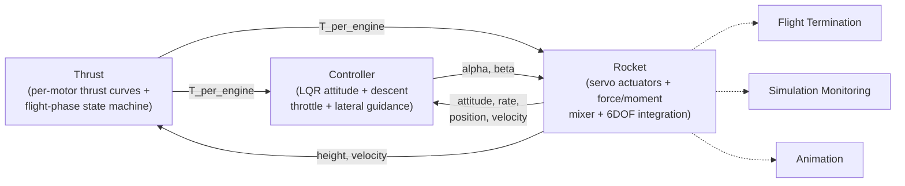

# TVC Rocket — 6DOF Flight Simulation

A 6DOF flight simulator for a three-motor thrust-vector-controlled (TVC)
rocket, built in MATLAB/Simulink. LQR/DCM attitude control, live mass/
inertia tracking, and closed-loop guidance from liftoff through landing.

Freelance build for client Kruthick Jothimani — milestone-based,
open-source-intent, "keep it simple" design. Physical rocket parameters
are not final; the real hardware is still under construction.

## How it works

Solid arrows are the closed control loop; dashed arrows are read-only
consumers (safety logic, scopes, 3D viewer) that don't feed anything
back. Full block-by-block detail lives in `MODEL_WALKTHROUGH.md`.

## Quick start

1. Open `rocket_upwork.slx` in Simulink.
2. Set MATLAB's current folder to the project root **first** — the
   model's `InitFcn` runs `matl.m`, which won't resolve otherwise.
3. Run or update the diagram as usual.

## What's inside

| File | Purpose |
|---|---|
| `rocket_upwork.slx` | canonical master model |
| `matl.m` | single source of truth for every plant parameter |
| `lqr_gain_design.m` | offline LQR gain design |
| `thrust_data_*_clean.csv` | motor thrust curves (descent is still a placeholder — see Status) |
| `MODEL_WALKTHROUGH.md` | guided tour of the model, block by block |
| `DEVELOPMENT_NOTES.md` | design decisions, known limitations, conventions |

## Requirements

- MATLAB + Simulink (recent release)
- Aerospace Blockset
- Stateflow

## Status

Milestone 1, ascent-focused. Descent thrust is still a flat placeholder
pending real motor test data. See `DEVELOPMENT_NOTES.md`'s "Known
limitations" for the full list of open items.
